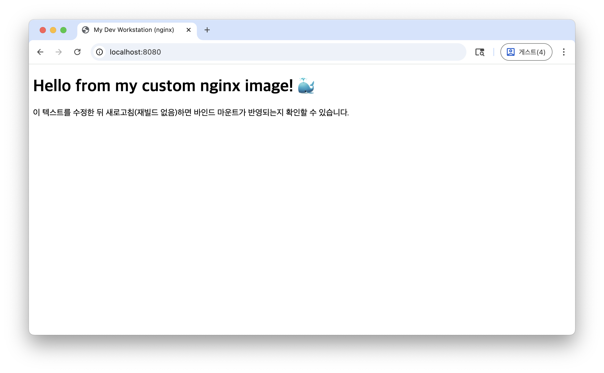
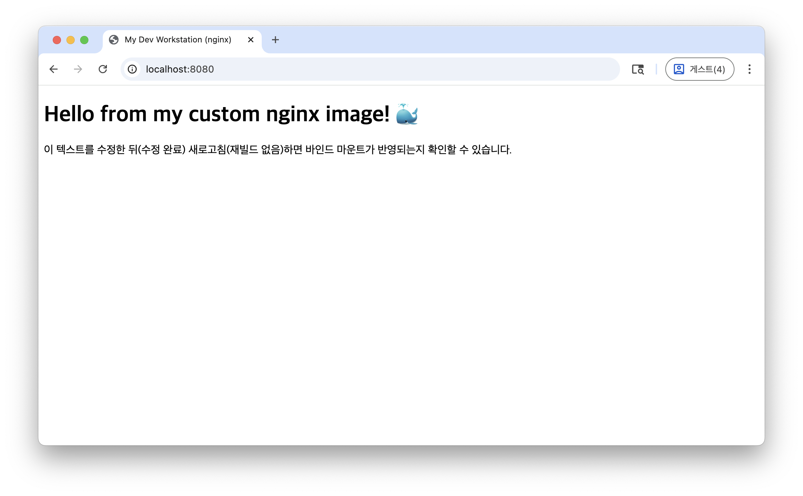
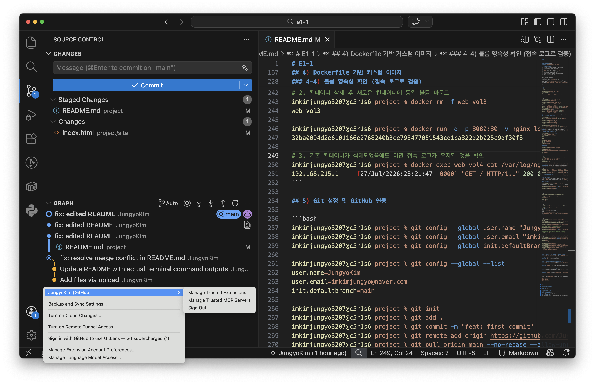
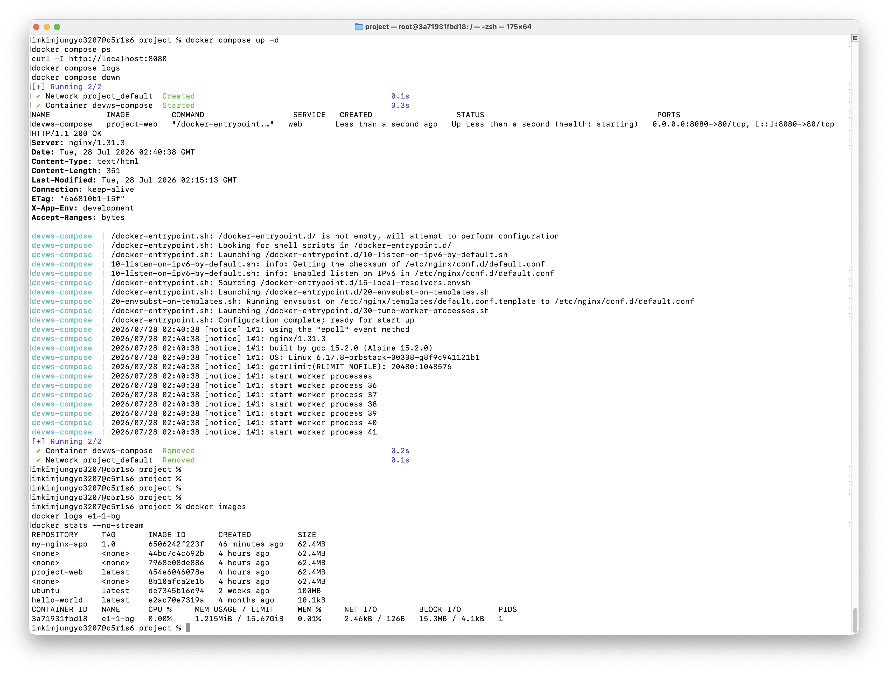

# E1-1

## 1) 실행 환경

- **OS**: macOS 15.7.7
- **Shell / Terminal**: zsh / macOS Console
- **컨테이너 런타임**: OrbStack
- **Docker**: `Docker version 28.5.2, build ecc6942`
- **Git**: `git version 2.39.5 (Apple Git-154)`

## 2) 수행 항목 체크리스트

- [x] 터미널 기본 조작 (이동/생성/복사/이름변경/삭제/내용확인)
- [x] 파일/디렉토리 권한 변경 실습 (각 1개 이상)
- [x] Docker 설치 확인 (`docker --version`, `docker info`)
- [x] `hello-world` 컨테이너 실행
- [x] `ubuntu` 컨테이너 진입 후 명령 실행 (`ls`, `echo`)
- [x] Dockerfile 기반 커스텀 이미지 빌드 및 실행
- [x] 포트 매핑 후 브라우저 접속 확인
- [x] 바인드 마운트로 변경사항 즉시 반영 확인
- [x] Docker 볼륨으로 데이터 영속성 확인 (컨테이너 삭제 전/후)
- [x] Git 사용자 정보 설정 + GitHub/VSCode 연동
- [x] (보너스) Docker Compose 실행 준비

## 3) 검증 방법 & 결과 위치

| 항목 | 확인한 명령 | 증거 위치 |
|---|---|---|
| Docker 버전/데몬 | `docker --version`, `docker info` | 3-2) 섹션 |
| 이미지/컨테이너 목록 | `docker ps -a` | 3-2) 섹션 |
| 커스텀 이미지 빌드 | `docker build -t my-nginx-app:1.0 .` | 4-1) 섹션 |
| 포트 매핑 | `docker run -p 8080:80 ...` + `curl -I` | 4-2) 섹션 |
| 바인드 마운트 | `-v $(pwd)/site:/usr/share/nginx/html` | 4-3) 섹션 |
| 볼륨 영속성 | `docker volume create` + `docker exec ... cat access.log` | 4-4) 섹션 |
| Git/GitHub | `git config --global --list`, `git push` | 5) 섹션 |

---

## 3-1) 터미널 조작 로그

### 작업 디렉토리 구성

```bash
imkimjungyo3207@c5r1s6 Documents % pwd
# pwd (print working directory): 현재 위치의 절대경로를 출력
/Users/imkimjungyo3207/Documents

imkimjungyo3207@c5r1s6 Documents % mkdir -p ~/e1-1
# mkdir: 디렉토리 생성
#   -p (parents): 상위 경로가 없어도 함께 생성, 이미 존재해도 에러 없이 무시
#   ~ : 홈 디렉토리(/Users/imkimjungyo3207)의 축약 표기
imkimjungyo3207@c5r1s6 Documents % cd ~/e1-1
# cd (change directory): 지정한 경로로 이동
imkimjungyo3207@c5r1s6 e1-1 % ls -la
# ls: 디렉토리 내용 목록
#   -l (long): 권한/소유자/크기/수정일 등 상세 정보 표시
#   -a (all): . 과 .. 포함 숨김 파일까지 표시
total 0
drwxr-xr-x   2 imkimjungyo3207  imkimjungyo3207   64  7 28 07:27 .
drwxr-x---+ 22 imkimjungyo3207  imkimjungyo3207  704  7 28 07:27 ..
```

### 기본 조작 (이동/생성/복사/이름변경/삭제/내용확인)

```bash
imkimjungyo3207@c5r1s6 e1-1 % touch test.txt
# touch: 파일이 없으면 빈 파일로 생성, 있으면 수정시각(mtime)만 갱신
imkimjungyo3207@c5r1s6 e1-1 % echo "test" > test.txt
# echo "문자열": 표준출력으로 문자열 출력
#   > : 리다이렉션(덮어쓰기) — 우측 파일의 기존 내용을 지우고 새로 씀 (누적하려면 >> 사용)
imkimjungyo3207@c5r1s6 e1-1 % cat test.txt
# cat (concatenate): 파일 내용을 표준출력으로 그대로 출력
test

imkimjungyo3207@c5r1s6 e1-1 % cp test.txt test_copy.txt
# cp <원본> <사본>: 원본은 유지한 채 파일 복사
imkimjungyo3207@c5r1s6 e1-1 % mv test_copy.txt test_renamed.txt
# mv <원본> <대상>: 파일 이동. 같은 디렉토리 내에서 쓰면 이름 변경(rename)으로 동작
imkimjungyo3207@c5r1s6 e1-1 % ls -la
total 16
drwxr-xr-x   4 imkimjungyo3207  imkimjungyo3207  128  7 28 07:33 .
drwxr-x---+ 22 imkimjungyo3207  imkimjungyo3207  704  7 28 07:27 ..
-rw-r--r--   1 imkimjungyo3207  imkimjungyo3207    5  7 28 07:33 test_renamed.txt
-rw-r--r--   1 imkimjungyo3207  imkimjungyo3207    5  7 28 07:32 test.txt

imkimjungyo3207@c5r1s6 e1-1 % rm test_renamed.txt
# rm (remove): 파일 삭제, 휴지통을 거치지 않고 즉시 삭제됨
imkimjungyo3207@c5r1s6 e1-1 % ls -la
total 8
drwxr-xr-x   3 imkimjungyo3207  imkimjungyo3207   96  7 28 07:34 .
drwxr-x---+ 22 imkimjungyo3207  imkimjungyo3207  704  7 28 07:27 ..
-rw-r--r--   1 imkimjungyo3207  imkimjungyo3207    5  7 28 07:32 test.txt
```

**절대 경로 vs 상대 경로**: `/Users/imkimjungyo3207/e1-1`과 같이 루트(`/`) 기준 전체 위치를 명시하는 경로는 절대 경로, `./test.txt` 또는 `~/e1-1`처럼 현재 작업 디렉토리 위치나 사용자 홈 디렉토리를 기준으로 참조하는 경로는 상대 경로입니다.

### 권한 실습 (파일 1개, 디렉토리 1개)

```bash
imkimjungyo3207@c5r1s6 e1-1 % ls -l test.txt
-rw-r--r--  1 imkimjungyo3207  imkimjungyo3207  5  7 28 07:32 test.txt

imkimjungyo3207@c5r1s6 e1-1 % chmod 644 test.txt
# chmod (change mode): 파일/디렉토리 권한 변경
#   644 = 소유자 rw-(6=4+2), 그룹 r--(4), 기타 r--(4)
#   숫자 표기는 8진수이며 각 자리는 Read=4 + Write=2 + Execute=1 의 합
imkimjungyo3207@c5r1s6 e1-1 % ls -l test.txt
-rw-r--r--  1 imkimjungyo3207  imkimjungyo3207  5  7 28 07:32 test.txt

imkimjungyo3207@c5r1s6 e1-1 % mkdir secure_dir
# mkdir: 디렉토리 생성 (옵션 없이 단일 디렉토리 생성)
imkimjungyo3207@c5r1s6 e1-1 % ls -ld secure_dir
# ls -ld: -d(directory) 옵션으로 디렉토리 "안의 목록"이 아니라 디렉토리 자체의 정보만 출력
drwxr-xr-x  2 imkimjungyo3207  imkimjungyo3207  64  7 28 07:35 secure_dir

imkimjungyo3207@c5r1s6 e1-1 % chmod 755 secure_dir
# 755 = 소유자 rwx(7=4+2+1), 그룹 r-x(5=4+1), 기타 r-x(5)
#   디렉토리는 진입(cd)에도 x 권한이 필요하므로 보통 5나 7을 부여
imkimjungyo3207@c5r1s6 e1-1 % ls -ld secure_dir
drwxr-xr-x  2 imkimjungyo3207  imkimjungyo3207  64  7 28 07:35 secure_dir
```

**권한 표기 설명**:
- **644**: 소유자 Read/Write(6), 그룹 Read(4), 기타 사용자 Read(4)
- **755**: 소유자 Read/Write/Execute(7), 그룹 Read/Execute(5), 기타 사용자 Read/Execute(5)

## 3-2) Docker 설치/점검 및 기본 운영 로그

```bash
imkimjungyo3207@c5r1s6 e1-1 % docker --version
# docker --version: 설치된 Docker 클라이언트의 버전만 간단히 출력
Docker version 28.5.2, build ecc6942

imkimjungyo3207@c5r1s6 e1-1 % docker info
# docker info: 클라이언트+서버(데몬) 상태, 컨텍스트(orbstack), 컨테이너/이미지 개수,
#              스토리지 드라이버, OS/아키텍처, CPU/메모리 등 시스템 전반 정보 출력
#              → 데몬이 정상 동작 중인지 확인하는 핵심 명령
Client:
 Version:    28.5.2
 Context:    orbstack
 Server:
  Containers: 0
  Server Version: 28.5.2
  Storage Driver: overlay2
  Operating System: OrbStack
  Architecture: x86_64
  CPUs: 6
  Total Memory: 15.67GiB
```

### hello-world

```bash
imkimjungyo3207@c5r1s6 e1-1 % docker run hello-world
# docker run <이미지>: 로컬에 이미지가 없으면 Docker Hub에서 자동 pull 후 컨테이너 생성·실행
#   hello-world는 실행되자마자 안내 메시지를 출력하고 즉시 종료되는 테스트 전용 이미지
Unable to find image 'hello-world:latest' locally
latest: Pulling from library/hello-world
4f55086f7dd0: Pull complete 
Digest: sha256:c3cbe1cc1aa588a64951ac6286e0df7b27fe2e6324b1001c619bb358770c0178
Status: Downloaded newer image for hello-world:latest

Hello from Docker!
This message shows that your installation appears to be working correctly.
```

### ubuntu 컨테이너 진입

```bash
imkimjungyo3207@c5r1s6 e1-1 % docker run -it --name e1-1 ubuntu bash
# docker run
#   -i (interactive): 표준입력(STDIN)을 컨테이너에 연결해 키보드 입력을 받을 수 있게 함
#   -t (tty): 가상 터미널 할당 → 사람이 보기 좋은 셸 프롬프트 환경 제공 (보통 -i와 세트로 -it)
#   --name e1-1: 임의 ID 대신 사람이 알아볼 수 있는 컨테이너 이름 지정
#   ubuntu bash: ubuntu 이미지를 기반으로, 컨테이너의 메인 프로세스(PID 1)로 bash 실행
root@1ad4285b802e:/# ls
bin   dev  home  lib64  mnt  proc  run   srv  tmp  var
boot  etc  lib   media  opt  root  sbin  sys  usr
root@1ad4285b802e:/# echo "container"
container
root@1ad4285b802e:/# exit
# exit: 셸 종료. 이 셸이 PID 1이므로 컨테이너도 함께 정지(Exited) 상태가 됨
exit
```

**attach/exec 차이 관찰**:
- **docker exec**: 실행 중인 컨테이너에 새로운 프로세스(Bash 등)를 개별적으로 실행하여 접근합니다. 터미널을 종료하더라도 기존 프로세스에 영향을 주지 않습니다.
- **docker attach**: 컨테이너의 PID 1 메인 프로세스(TTY Standard Stream)에 직접 연결되므로, 종료 명령(Ctrl+C 등)을 내릴 경우 메인 프로세스가 종료되어 컨테이너가 함께 멈추게 됩니다.

### 이미지/컨테이너 확인

```bash
imkimjungyo3207@c5r1s6 e1-1 % docker ps -a
# docker ps: 기본적으로 "실행 중인" 컨테이너만 표시
#   -a (all): 종료(Exited)된 컨테이너까지 전부 표시
CONTAINER ID   IMAGE         COMMAND            CREATED          STATUS                      PORTS     NAMES
3a71931fbd18   ubuntu        "sleep infinity"   18 minutes ago   Up 18 minutes                         e1-1-bg
1ad4285b802e   ubuntu        "bash"             20 minutes ago   Exited (0) 19 minutes ago             e1-1
2fb1c53c1b7e   hello-world   "/hello"           28 minutes ago   Exited (0) 28 minutes ago             jolly_bohr
80dfa6dede6b   hello-world   "/hello"           28 minutes ago   Exited (0) 28 minutes ago             priceless_albattani
```

### 이미지 목록 / 로그 / 리소스 확인

```bash
imkimjungyo3207@c5r1s6 project % docker images
# docker images: 로컬에 저장된 이미지 목록
#   (REPOSITORY, TAG, IMAGE ID, CREATED, SIZE 컬럼 출력)
REPOSITORY     TAG       IMAGE ID       CREATED          SIZE
my-nginx-app   1.0       6506242f223f   46 minutes ago   62.4MB
<none>         <none>    44bc7c4c692b   4 hours ago      62.4MB
<none>         <none>    7968e08de886   4 hours ago      62.4MB
project-web    latest    454e6046078e   4 hours ago      62.4MB
<none>         <none>    8b10afca2e15   4 hours ago      62.4MB
ubuntu         latest    de7345b16e94   2 weeks ago      100MB
hello-world    latest    e2ac70e7319a   4 months ago     10.1kB

imkimjungyo3207@c5r1s6 project % docker logs e1-1-bg
# docker logs <컨테이너>: 해당 컨테이너의 표준출력/표준에러 로그 확인
#   e1-1-bg는 "sleep infinity"만 실행 중이라 남길 로그가 없어 빈 출력
(출력 없음 — e1-1-bg는 "sleep infinity"만 실행 중이라 표준출력으로 남기는 로그가 없음)

imkimjungyo3207@c5r1s6 project % docker stats --no-stream
# docker stats: 실행 중인 컨테이너의 CPU/메모리/네트워크/디스크 I/O 실시간 표시
#   --no-stream: top처럼 계속 갱신하지 않고 한 번만 스냅샷 출력
CONTAINER ID   NAME      CPU %     MEM USAGE / LIMIT     MEM %     NET I/O         BLOCK I/O        PIDS
3a71931fbd18   e1-1-bg   0.00%     1.215MiB / 15.67GiB   0.01%     2.46kB / 126B   15.3MB / 4.1kB   1
```

## 4) Dockerfile 기반 커스텀 이미지

**선택한 방식**: 웹 서버 베이스 이미지(`nginx:alpine`) + 정적 콘텐츠/설정 교체

**적용한 커스텀 포인트**:
- `site/` 정적 콘텐츠로 기본 Nginx 웰컴 페이지 교체
- `default.conf.template`로 Nginx 설정 교체 → 커스텀 응답 헤더(`X-App-Env`) 추가
- 환경 변수 `APP_ENV` 도입 → 공식 Nginx 이미지의 템플릿 렌더링(`envsubst`) 기능으로 재빌드 없이 `-e`만 바꿔도 응답 헤더가 변화함
- HEALTHCHECK 검증 → Nginx 설정 및 헬스체크 구문 디버깅 완료 후 healthy 상태 검증

### 4-1) 빌드 및 실행

```bash
imkimjungyo3207@c5r1s6 project % docker build -t my-nginx-app:1.0 .
# docker build: Dockerfile을 읽어 이미지를 빌드
#   -t my-nginx-app:1.0 (tag): 빌드 결과 이미지에 "이름:태그" 형식으로 태그 부여 (생략 시 기본 latest)
#   . : 빌드 컨텍스트 경로 — Dockerfile 및 COPY/ADD가 참조할 파일들이 있는 디렉토리
#       (반드시 Dockerfile이 있는 위치에서 실행해야 함 → 트러블슈팅 사례 1 참고)
[+] Building 1.6s (8/8) FINISHED                                   docker:orbstack
 => naming to docker.io/library/my-nginx-app:1.0                               0.0s

imkimjungyo3207@c5r1s6 project % docker run -d -p 8080:80 -v nginx-logs:/var/log/nginx --name web-vol5 my-nginx-app:1.0
# docker run
#   -d (detach): 컨테이너를 백그라운드로 실행하고 컨테이너 ID만 반환
#   -p 8080:80 (publish): 호스트포트:컨테이너포트 매핑. 호스트 8080 → 컨테이너 내부 80(nginx 기본 포트)
#   -v nginx-logs:/var/log/nginx (volume): "볼륨이름:컨테이너내부경로"
#       nginx-logs라는 이름의 Docker 관리형 볼륨을 컨테이너 로그 경로에 마운트
#   --name web-vol5: 컨테이너 이름 지정
953944bb7b2918eafc871761f2b3b81885639db74fb846957a5e3723e2b12042

imkimjungyo3207@c5r1s6 project % docker ps -a
CONTAINER ID   IMAGE              COMMAND                  CREATED          STATUS                    PORTS                  NAMES
953944bb7b29   my-nginx-app:1.0   "/docker-entrypoint.…"   11 seconds ago   Up 11 seconds (healthy)   0.0.0.0:8080->80/tcp   web-vol5
```

### 4-2) 포트 매핑 접속 증거 (+ 환경변수로 응답 달라지는 것 확인)

```bash
imkimjungyo3207@c5r1s6 project % docker run -d -p 8080:80 -e APP_ENV=production --name web1 my-nginx-app:1.0
# -e APP_ENV=production (env): 컨테이너 내부에 환경변수 주입
#   nginx 공식 이미지의 envsubst 템플릿 기능이 이 값을 읽어 X-App-Env 응답 헤더를 동적으로 렌더링
#   → 재빌드 없이 -e 값만 바꿔도 응답 헤더가 달라짐
608d73d0c827fa5b3db8fb902918fa574405feeb4cc4a9597b0f9b476aa13dea

imkimjungyo3207@c5r1s6 project % curl -I http://localhost:8080
# curl: HTTP 요청 전송
#   -I (head): 응답 바디 없이 헤더만 요청/출력 (HEAD 메서드와 유사하게 동작)
HTTP/1.1 200 OK
Server: nginx/1.31.3
Date: Mon, 27 Jul 2026 23:11:20 GMT
Content-Type: text/html
Content-Length: 336
X-App-Env: production
Connection: keep-alive
```

### 4-3) 바인드 마운트 반영 확인

```bash
imkimjungyo3207@c5r1s6 project % docker run -d -p 8080:80 -v $(pwd)/site:/usr/share/nginx/html --name web-bind my-nginx-app:1.0
# -v $(pwd)/site:/usr/share/nginx/html : 바인드 마운트(bind mount)
#   볼륨 이름 대신 "호스트의 실제 절대경로"($(pwd)/site)를 컨테이너 경로에 직접 연결
#   호스트에서 파일을 수정하면 재빌드·재시작 없이 즉시 반영됨
#   (named volume과 달리 호스트 파일시스템 경로를 그대로 공유하는 방식)
6ec1f26462e7fe748274399b3a2b7717607bcae3e8ebea491eae6a509b6adeca

imkimjungyo3207@c5r1s6 project % curl http://localhost:8080
# curl (옵션 없음): GET 요청을 보내고 응답 바디를 그대로 출력
<!DOCTYPE html>
<html lang="ko">
<head>
  <meta charset="UTF-8" />
  <title>My Dev Workstation (nginx)</title>
</head>
<body>
  <h1>Hello from my custom nginx image! 🐳</h1>
  <p>이 텍스트를 수정한 뒤 새로고침(재빌드 없음)하면 바인드 마운트가 반영되는지 확인할 수 있습니다.</p>
</body>
</html>
```




### 4-4) 볼륨 영속성 확인 (접속 로그로 검증)

```bash
# 1. 볼륨 생성 및 1차 컨테이너 실행
imkimjungyo3207@c5r1s6 project % docker volume create nginx-logs
# docker volume create <이름>: named volume을 명시적으로 미리 생성
#   (run 시 자동 생성도 가능하지만 여기선 명시적으로 생성)
nginx-logs

imkimjungyo3207@c5r1s6 project % docker run -d -p 8080:80 -v nginx-logs:/var/log/nginx --name web-vol3 my-nginx-app:1.0
f1873b3ac150699c342f5f2adf59589088e8a9604f332b69fbee05f4a9ae81c7

imkimjungyo3207@c5r1s6 project % curl http://localhost:8080
imkimjungyo3207@c5r1s6 project % docker exec web-vol3 cat /var/log/nginx/custom_access.log
# docker exec <컨테이너> <명령>: 실행 중인 컨테이너 내부에서 임의 명령 실행
#   여기서는 컨테이너 안의 로그 파일 내용을 cat으로 확인
192.168.215.1 - - [27/Jul/2026:23:21:47 +0000] "GET / HTTP/1.1" 200 0 "-" "curl/8.7.1"

# 2. 컨테이너 삭제 후 새로운 컨테이너에 동일 볼륨 마운트
imkimjungyo3207@c5r1s6 project % docker rm -f web-vol3
# docker rm <컨테이너>: 정지된 컨테이너 삭제
#   -f (force): 실행 중이어도 강제로 정지+삭제를 한 번에 수행
web-vol3

imkimjungyo3207@c5r1s6 project % docker run -d -p 8080:80 -v nginx-logs:/var/log/nginx --name web-vol4 my-nginx-app:1.0
# 위와 동일한 named volume(nginx-logs)을 새 컨테이너(web-vol4)에 다시 마운트
32ba0094d2e6101166e2768240b3ce795477051543ce1ba322d2b025c9df30f8

# 3. 기존 컨테이너가 삭제되었음에도 이전 접속 로그가 유지된 것을 확인
imkimjungyo3207@c5r1s6 project % docker exec web-vol4 cat /var/log/nginx/custom_access.log
# → 컨테이너(web-vol3)는 삭제됐지만 볼륨은 컨테이너 생명주기와 독립적으로 유지되어
#   새 컨테이너에서도 이전 로그가 그대로 보임 = 볼륨 영속성 증명
192.168.215.1 - - [27/Jul/2026:23:21:47 +0000] "GET / HTTP/1.1" 200 0 "-" "curl/8.7.1"
```

## 5) Git 설정 및 GitHub 연동

```bash
imkimjungyo3207@c5r1s6 project % git config --global user.name "JungyoKim"
# git config: Git 설정값 지정
#   --global: 이 머신의 모든 저장소에 공통 적용 (저장소별 한정은 --local, 시스템 전체는 --system)
#   user.name: 커밋에 기록될 작성자 이름
imkimjungyo3207@c5r1s6 project % git config --global user.email "imkimjungyo@naver.com"
# user.email: 커밋에 기록될 작성자 이메일
imkimjungyo3207@c5r1s6 project % git config --global init.defaultBranch main

imkimjungyo3207@c5r1s6 project % git config --global --list
# --list: 현재 적용된 전체 설정 값을 출력
user.name=JungyoKim
user.email=imkimjungyo@naver.com
init.defaultbranch=main

imkimjungyo3207@c5r1s6 project % git init
# git init: 현재 디렉토리를 Git 저장소로 초기화 (.git 폴더 생성)
imkimjungyo3207@c5r1s6 project % git add .
# git add . : 현재 디렉토리 기준 모든 변경사항을 스테이징 영역(index)에 추가
imkimjungyo3207@c5r1s6 project % git commit -m "feat: first commit"
# git commit -m "메시지": 스테이징된 변경사항을 커밋
#   -m (message): 커밋 메시지를 인자로 바로 전달 (에디터를 열지 않음)
imkimjungyo3207@c5r1s6 project % git remote add origin https://github.com/JungyoKim/Codyssey-E1-1
# git remote add origin <URL>: "origin"이라는 이름으로 원격 저장소 주소 등록
#   (관례상 기본 원격 저장소 이름으로 origin을 사용)
imkimjungyo3207@c5r1s6 project % git pull origin main --no-rebase --allow-unrelated-histories
# git pull origin main: 원격 origin의 main 브랜치를 fetch + merge
#   --no-rebase: merge 방식으로 병합(3-way merge, merge commit 생성) — 기본 동작 명시
#   --allow-unrelated-histories: 로컬/원격이 공통 조상 커밋이 없는 별개 히스토리일 때
#       (예: GitHub에서 README를 자동 생성한 경우) 강제로 병합을 허용
imkimjungyo3207@c5r1s6 project % git checkout --ours README.md
# git checkout --ours <파일>: merge conflict 발생 시 해당 파일에 대해 "내 쪽(로컬) 버전"을 채택
#   상대편(원격) 버전을 채택하려면 --theirs 사용
imkimjungyo3207@c5r1s6 project % git add README.md
# 충돌 해결한 파일을 다시 스테이징
imkimjungyo3207@c5r1s6 project % git commit -m "fix: resolve merge conflict in README.md"
# merge conflict 해결 후 병합 커밋 완료
imkimjungyo3207@c5r1s6 project % git push -u origin main
# git push origin main: 로컬 main 브랜치를 원격 origin의 main으로 업로드
#   -u (--set-upstream): 로컬 main을 origin/main과 추적 관계로 연결
#       이후부터는 git push만 입력해도 자동으로 어디로 push할지 인식
To https://github.com/JungyoKim/Codyssey-E1-1
   611ad93..54e7e42  main -> main
branch 'main' set up to track 'origin/main'.
```



## 6) 트러블슈팅

### 사례 1: 루트 경로에서 docker build 실행 시 Dockerfile 부재 오류

**문제**: `docker build -t my-nginx-app:1.0 .` 실행 시 `ERROR: failed to read dockerfile: open Dockerfile: no such file or directory` 에러 발생.

**원인 가설**: 현재 작업 위치가 `~/e1-1`이라 상위 폴더에 Dockerfile이 존재하지 않음.

**확인 방법**: `pwd` 및 `ls`로 디렉토리 내용 확인.

**해결/대안**: `cd project`로 압축 해제된 소스 폴더 진입 후 다시 빌드 진행.

### 사례 2: Docker 컨테이너 Name Conflict (중복 실행/삭제 누락)

**문제**: `docker run ... --name web-vol2` 실행 시 `Conflict. The container name "/web-vol2" is already in use` 발생.

**원인 가설**: 이전에 생성된 web-vol2 컨테이너가 Created 또는 Exited 상태로 정리가 안 됨.

**확인 방법**: `docker ps -a` 출력 결과에서 460efae75897 ID의 web-vol2 확인.

**해결/대안**: `docker rm web-vol2` (또는 `docker rm -f web-vol2`) 실행 후 명령 재요청.

### 사례 3: GitHub Push 거부 및 충돌 (Divergent Branches)

**문제**: Remote 레포지토리에 README 등이 미리 존재하여 `git push` 시 rejection 에러 발생.

**원인 가설**: Local과 Remote의 히스토리가 공유되지 않은 독립적 커밋(unrelated histories) 상태.

**확인 방법**: `git push` 실행 로그 내 `! [rejected] main -> main (fetch first)` 확인.

**해결/대안**: `git pull origin main --no-rebase --allow-unrelated-histories`로 이력을 병합하고, 충돌된 README.md를 `git checkout --ours README.md`로 정리 후 병합 커밋을 작성하여 푸시 완료.

## 7) Docker Compose

프로젝트 내 포함된 `docker-compose.yml`을 통해 멀티 컨테이너 환경 조작 가능:

```bash
$ docker compose up -d
# docker compose up: docker-compose.yml에 정의된 모든 서비스+네트워크를 일괄 기동
#   -d (detach): 백그라운드로 실행
[+] Running 2/2
 ✔ Network project_default  Created
 ✔ Container devws-compose  Started

$ docker compose ps
# docker compose ps: compose가 관리하는 컨테이너들의 상태만 별도로 조회
NAME            IMAGE         COMMAND                   SERVICE   STATUS                    PORTS
devws-compose   project-web   "/docker-entrypoint.…"   web       Up (health: starting)     0.0.0.0:8080->80/tcp

$ curl -I http://localhost:8080
HTTP/1.1 200 OK
Server: nginx/1.31.3
X-App-Env: development
...

$ docker compose logs
# docker compose logs: compose로 띄운 전체 서비스의 로그를 한 번에 조회
devws-compose  | 2026/07/28 02:40:38 [notice] 1#1: nginx/1.31.3
devws-compose  | 2026/07/28 02:40:38 [notice] 1#1: start worker processes
...

$ docker compose down
# docker compose down: 관련 컨테이너 + 네트워크를 한 번에 정지·삭제
#   (볼륨은 -v 옵션을 추가로 붙이지 않는 한 그대로 유지됨)
[+] Running 2/2
 ✔ Container devws-compose  Removed
 ✔ Network project_default  Removed
```



## 8) 개념 정리

**절대경로 vs 상대경로**:
루트(`/`)부터 파일 전체 경로를 명시하는 '절대경로'는 실행 환경에 영향받지 않으며, 현재 위치(`.`)를 기준으로 상대적 거리를 계산하는 '상대경로'는 가독성과 이식성이 좋음.

**파일 권한(r/w/x, 755/644)**:
리눅스/Unix 보안 체계로 Read(4), Write(2), Execute(1) 조합을 소유자/그룹/기타 사용자 세 영역으로 지정함.

**커스텀 이미지**:
기존 베이스 이미지(`nginx:alpine` 등)에 사용자 애플리케이션 코드, 설정 파일 및 빌드 환경을 얹어 재사용 가능하게 팩토리화한 독립 실행 단위.

**포트 매핑이 필요한 이유**:
격리된 컨테이너 내부의 네트워크 포트를 호스트 OS의 포트와 바인딩(8080:80)하여 외부 네트워크 access를 개방하기 위함.

**Docker 볼륨(영속 데이터)**:
컨테이너의 생명주기(Lifecycle)와 독립된 호스트 파일시스템 영역에 데이터를 영구 바인딩하여 저장하는 매커니즘.

**Git vs GitHub 역할 차이**:
Git은 로컬 컴퓨터에서 코드 변경 이력을 추적하는 분산 버전 관리 시스템(VCS)이고, GitHub는 Git 레포지토리를 원격에서 호스팅하고 협업을 지원하는 Cloud 서비스.
